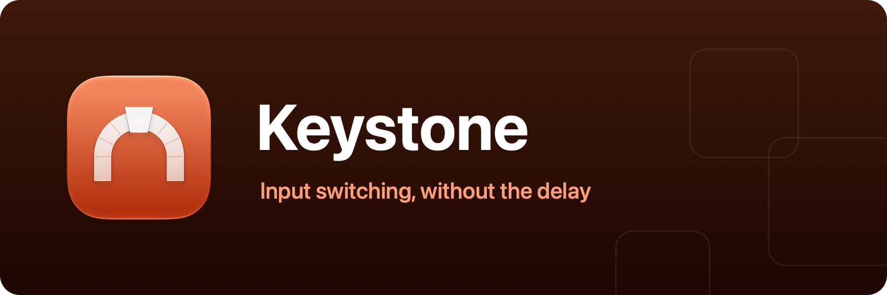

<p align="center">
  
</p>

<p align="center">
  Instant input-source switching for macOS, Caps Lock, rerouted to a spare key at the HID layer.<br />
  A single Swift Package, builds with the <code>swift</code> CLI alone, no Xcode project required.
</p>

## What it does

macOS can switch input sources with Caps Lock, but that path carries a deliberate delay
(it has to distinguish a tap from engaging Caps Lock). The classic fix is to remap
Caps Lock to a spare function key and bind "Select next source in Input menu" to it,
usually via Karabiner-Elements, which runs a virtual keyboard driver and daemons for the
privilege.

Keystone does the remap the way `hidutil` does: it books a `UserKeyMapping` entry into
macOS's own HID event system, where the **kernel** rewrites Caps Lock → F19. No virtual
driver, no event tap, no Accessibility or Input Monitoring permission, no process of
Keystone's ever sees a keystroke. The app itself just sits in the menu bar and
re-asserts the mapping when the system would forget it (wake from sleep, a keyboard
reconnecting).

## Setup

1. If Karabiner-Elements was doing this job, uninstall it first (its settings window →
   Uninstall), quitting is not enough, its daemons keep remapping.
2. Launch Keystone and follow the onboarding.
3. In System Settings › Keyboard › Keyboard Shortcuts… › Input Sources, record
   "Select next source in Input menu" by pressing Caps Lock (it already types F19).

## Settings

- **General**: launch at login, the remap toggle, destination key (F13–F20, F19 by
  default), and a shortcut to the Keyboard settings pane.

## Development

```sh
swift run                # menu bar app, dev build
./Scripts/dev.sh         # rebuild-and-relaunch loop
./Scripts/test.sh        # unit tests
./Scripts/bundle.sh      # standalone build/Keystone.app
```

## Notes

- The remap is active exactly while Keystone runs: quitting (or toggling it off)
  clears the mapping and hands Caps Lock back to stock macOS. Launch at login keeps
  it seamless across restarts.
- A force-quit or crash can't clean up after itself; the next launch, toggle, or
  reboot sweeps the mapping away.

## License

MIT, see [LICENSE](LICENSE). Bundled third-party software and its licenses are listed in [THIRD-PARTY-NOTICES.md](THIRD-PARTY-NOTICES.md).
